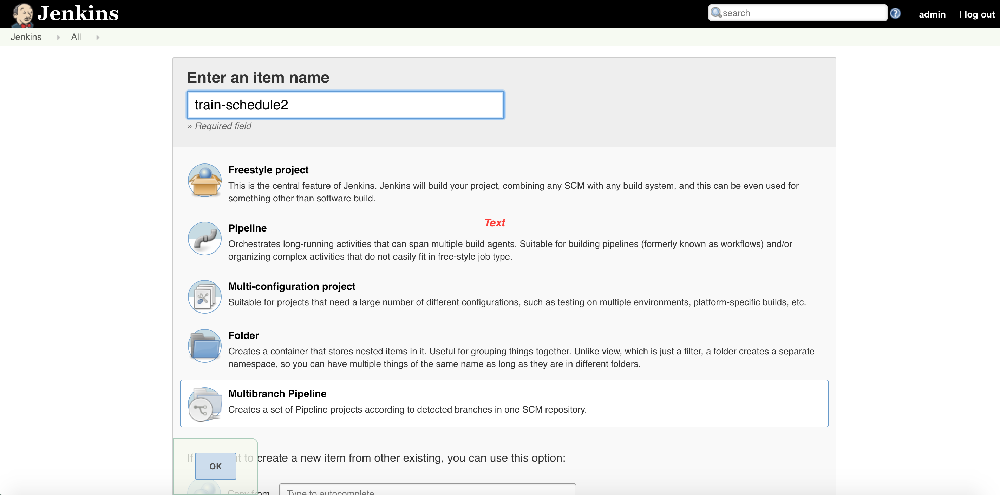

# Jenkins-K8s
Full CI/CD Pipeline running on Google Kubernetes Engine (GKE)

This guide will take you through the steps necessary to continuously deliver your software to end users by leveraging [Google Kubernetes Engine] and [Jenkins](https://jenkins.io) to orchestrate the software delivery pipeline.

Following steps can be done on your local machines as well (by installing gcloud SDK). However in this tutorial we will use Google Cloud Shell.

### Prerequisites
1. A Google Cloud Platform Account
2. [Enable the Compute Engine, Kubernetes Engine, and Container Builder APIs](https://console.cloud.google.com/flows/enableapi?apiid=compute_component,container,cloudbuild.googleapis.com)


### Starting and setting up a new Project on Google Cloud Platform

1. Create a new Google Cloud Platform project: [https://console.developers.google.com/project]
2. Open the Google Cloud Shell. (Icon Located on top right corner of the console)


 When the shell is open, set your default compute zone:
```shell
  $ gcloud config set compute/zone us-east1-d
  ```

 Clone the lab repository in your cloud shell, then `cd` into that dir:
  ```shell
  $ git clone https://github.com/afanrasool/Jenkins-K8s.git
 

  $ cd Jenkins-K8s
  ```
  
 ### Setting up a new Kubernetes Cluster
 
 ```shell
gcloud container clusters create jenkins-cd \
--num-nodes 2 \
--machine-type n1-standard-2 \
--scopes "https://www.googleapis.com/auth/projecthosting,cloud-platform"
```

Once that operation completes download the credentials for your cluster 
```shell
$ gcloud container clusters get-credentials jenkins-cd
Fetching cluster endpoint and auth data.
kubeconfig entry generated for jenkins-cd.
```

Confirm that the cluster is running and `kubectl` is working by listing pods:

```shell
$ kubectl get pods
No resources found.
```

## Setting up Jenkins on our cluster
  First we install Helm , which is a package manager for Kubernetes. We will use helm to install Jenkins on our cluster.
  
  
 ```shell
 wget https://storage.googleapis.com/kubernetes-helm/helm-v2.9.1-linux-amd64.tar.gz
 tar zxfv helm-v2.9.1-linux-amd64.tar.gz
 cp linux-amd64/helm .
 ```
  
  

  Setting up a new service account: "tiller" , so that Jenkins has permission in our cluster:
    
  ```shell
  kubectl create clusterrolebinding cluster-admin-binding --clusterrole=cluster-admin --user=$(gcloud config get-value account)
  kubectl create serviceaccount tiller --namespace kube-system
  kubectl create clusterrolebinding tiller-admin-binding --clusterrole=cluster-admin --serviceaccount=kube-system:tiller
  ```


 Initializing Helm and making sure its working.

   ```shell
   ./helm init --service-account=tiller
   ./helm update
   ./helm version
   ```

 Using Helm to Install Jenkins

   ```shell
   ./helm install -n cd stable/jenkins -f jenkins/values.yaml --version 0.16.6 --wait
   ```

 Once Jenkins is installed ensure the Jenkins pod goes to the `Running` state and the container is in the `READY` state:

   ```shell
   $ kubectl get pods
   NAME                          READY     STATUS    RESTARTS   AGE
   cd-jenkins-7c786475dd-vbhg4   1/1       Running   0          1m
   ```

 


## Connect to Jenkins

Run the following command to setup port forwarding to the Jenkins UI from the Cloud Shell

   ```shell
   export POD_NAME=$(kubectl get pods -l "component=cd-jenkins-master" -o jsonpath="{.items[0].metadata.name}")
   kubectl port-forward $POD_NAME 8080:8080 >> /dev/null &
   ```
    
The Jenkins chart will automatically create an admin password for you. To retrieve it, run:

   ```shell
   printf $(kubectl get secret cd-jenkins -o jsonpath="{.data.jenkins-admin-password}" | base64 --decode);echo
   ```

 To get to the Jenkins user interface, click on the Web Preview button in cloud shell, then click “Preview on port 8080”:


You should see the Jenkins UI now. Use `admin` as the username and the password generated in the previous step to log into Jenkins.


## Starting a new Pipeline on Jenkins

Once the Jenkins UI is open, Add your GitHub credentials ( or in other source repository you are using) to Jenkins by clicking Credentials on the main page of Jenkins then Clicking on Global.

1. Start a new Job by clicking on `New Item` on the Jenkins homepage. Give a name to your project and click MultiBranch Pipeline then click `Ok`



2. Give a name to your project and then under `Branch Sources` , select Git then add the git repository URL to the `Project Repository` field. In credentials select the Github credentials that you created from the drop down menu and click save.


The Jenkins Pipeline should be up and running now with the Pipeline configuration defined in the Jenkinsfile which is located in the Source code of the Git repository which we added to the Jenkins Pipeline Project.

